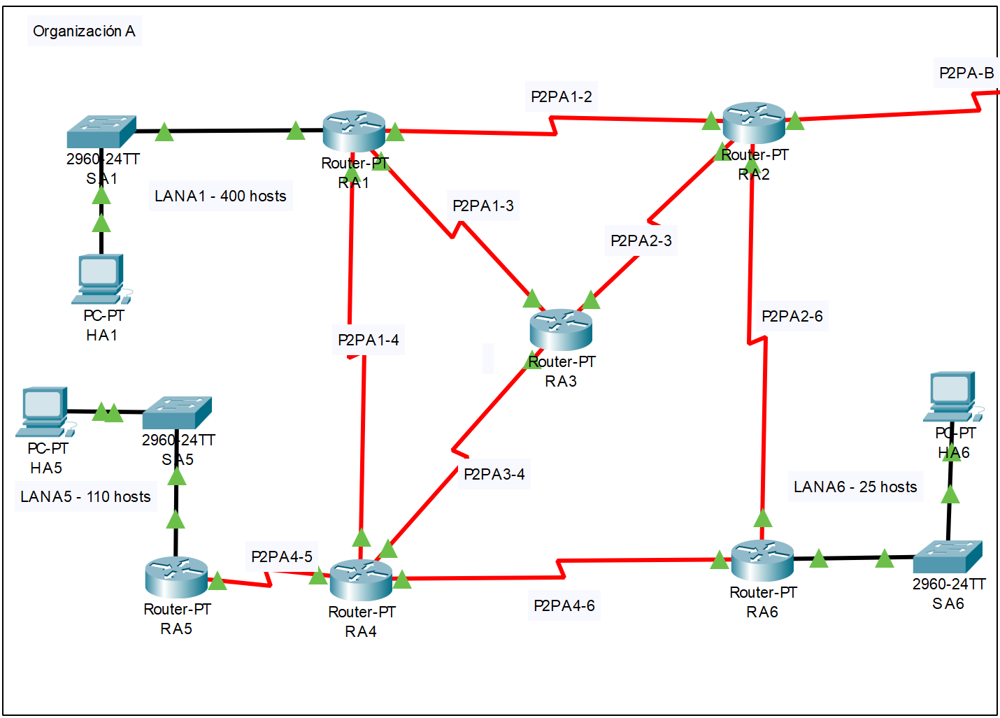
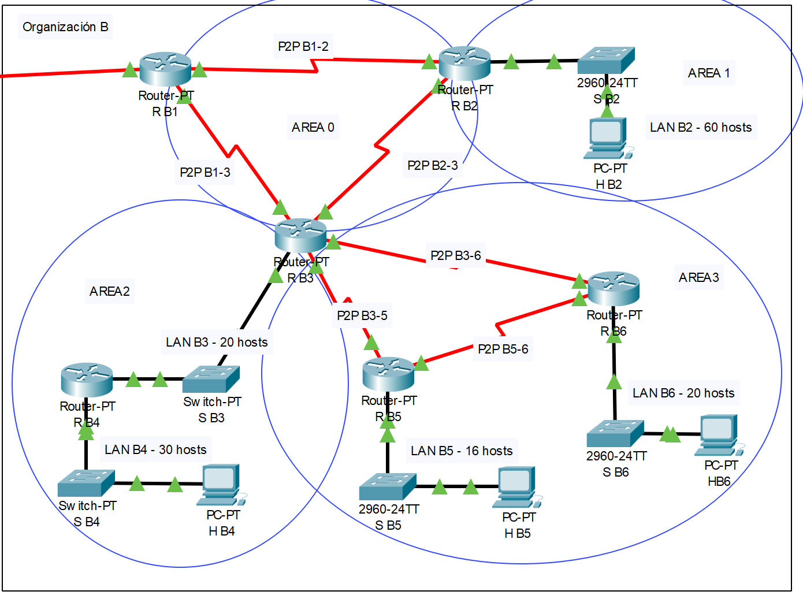
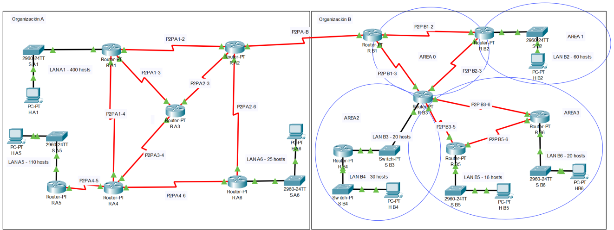

# AR-PracticaFinal

Práctica final de **Arquitectura de Redes** (Grado en Ingeniería Informática, Universidad de Murcia, curso 2026/2027).

El enunciado oficial está incluido en el repositorio: [`AR_PR07_practica-final.pdf`](AR_PR07_practica-final.pdf).

## Contenido del repositorio

| Archivo | Descripción |
|---|---|
| `AR_PR07_practica-final.pdf` | Guion (enunciado) de la práctica final |
| `practica_final.pkt` | Escenario de simulación de Cisco Packet Tracer |
| `subneting.pdf` | Borrador del plan de direccionamiento de la Organización A |

## Descripción del trabajo

Dos organizaciones (A y B) colaboran en la gestión de sus redes. Con **Cisco Packet Tracer** se diseñan, configuran e interconectan ambas, tomando el papel del personal de ingeniería y administración de red. Las LAN son Ethernet y los enlaces WAN son punto a punto serie. Todos los routers son *Router-PT* y los switches *2960-24TT*.

El trabajo se divide en tres fases, que siguen las secciones del guion:

### 1. Direccionamiento (Sección 3)

Se diseña el direccionamiento de todas las LAN y enlaces P2P con **VLSM**, a partir de los rangos asignados:

- Organización A: `172.YZ.(16*X).0/22`
- Organización B: `17X.YZ.16.0/20`

donde `X` es el grupo de teoría (1–3), `Y` la última cifra del DNI del primer miembro del equipo y `Z` la del segundo.

| Organización | Topología | Objetivo del direccionamiento |
|---|---|---|
| **A** | 6 routers (RA1–RA6), LAN de 400, 110 y 25 hosts | Minimizar los hosts desperdiciados en cada subred |
| **B** | 6 routers (RB1–RB6), LAN de 60, 20, 30, 16 y 20 hosts, organizada en 4 áreas | Minimizar las tablas de rutas mediante **agregación** por área |

**Topología de la Organización A**

**Topología de la Organización B**

Requisitos: cada subred debe cubrir todos los hosts y routers conectados a ella (la interfaz del router cuenta como host), sin solapamientos.

Para este equipo (X = 3, Y = 1, Z = 8) los rangos resultantes son `172.81.48.0/22` (A) y `173.81.16.0/20` (B).

### 2. Encaminamiento intra-dominio IPv4 (Sección 4)

- **Organización A: RIP.** Interfaces pasivas donde no se necesite el protocolo y ruta por defecto en los hosts. Cuestiones sobre:
  - tablas de rutas de RA4 y camino óptimo hacia la interfaz P2PA-B de RA2,
  - *split horizon*,
  - `tracert` desde HA5,
  - convergencia al desactivar el enlace óptimo,
  - *triggered updates* y *poison reverse*.
- **Organización B: OSPF**, con las áreas:
  - Área 0: RB1, RB2, RB3
  - Área 1: RB2
  - Área 2: RB3, RB4
  - Área 3: RB3, RB5, RB6

  Cuestiones sobre:
  - `traceroute` y caída de enlace,
  - elección de DR/BDR en la LAN B3,
  - *stub area* (área 3) y *totally stub area* (área 2),
  - modificación de costes para forzar el camino por RB6,
  - agregación de rutas en los ABR.

Tras la convergencia, todas las tablas de rutas deben estar completas y permitir conectividad entre cualquier par de subredes.

### 3. Interconexión y redistribución de rutas (Sección 5)

Se conectan las dos organizaciones con un nuevo enlace **RA2 – RB1**. RB1 actúa como router frontera: ejecuta RIP además de OSPF y **redistribuye rutas** entre ambos protocolos. Cuestiones sobre:

- tablas de rutas de RA2 y RB1,
- `traceroute` de HA5 a HB6, y cómo RA3 (RIP) obtiene información del otro sistema autónomo,
- comprobación del carácter de totally stub (Área 2) y stub (Área 3) tras la redistribución,
- captura de tráfico OSPF con al menos cuatro tipos de LSA distintos.

> Las preguntas de la Sección 5 deben responderse **después** de las de las Secciones 2–4, ya que la interconexión modifica las tablas de rutas.

## Entrega

1. Archivo comprimido con el escenario de Packet Tracer (`.pkt`).
2. Memoria en PDF, que debe incluir:
   - portada con nombre, DNI, correo y grupo de prácticas de cada miembro,
   - justificación del direccionamiento y de la configuración de los protocolos,
   - respuesta razonada a todas las cuestiones,
   - configuraciones relevantes con su explicación,
   - seguimiento de la guía de estilo del Aula Virtual.

Equipos de **máximo dos personas**. Fecha límite: **6 de diciembre de 2026** (improrrogable).

## Evaluación

- La práctica es obligatoria y supone el **40 %** de la nota final.
- Para hacer media con teoría, la nota de prácticas debe ser ≥ 5 sobre 10.
- Puede haber entrevista de prácticas individual. La nota final es individual y en la entrevista solo se puede consultar la terminal de comandos.
- Que la red funcione no garantiza el aprobado: debe cumplir los requisitos del enunciado y la memoria debe responder adecuadamente a las preguntas.
